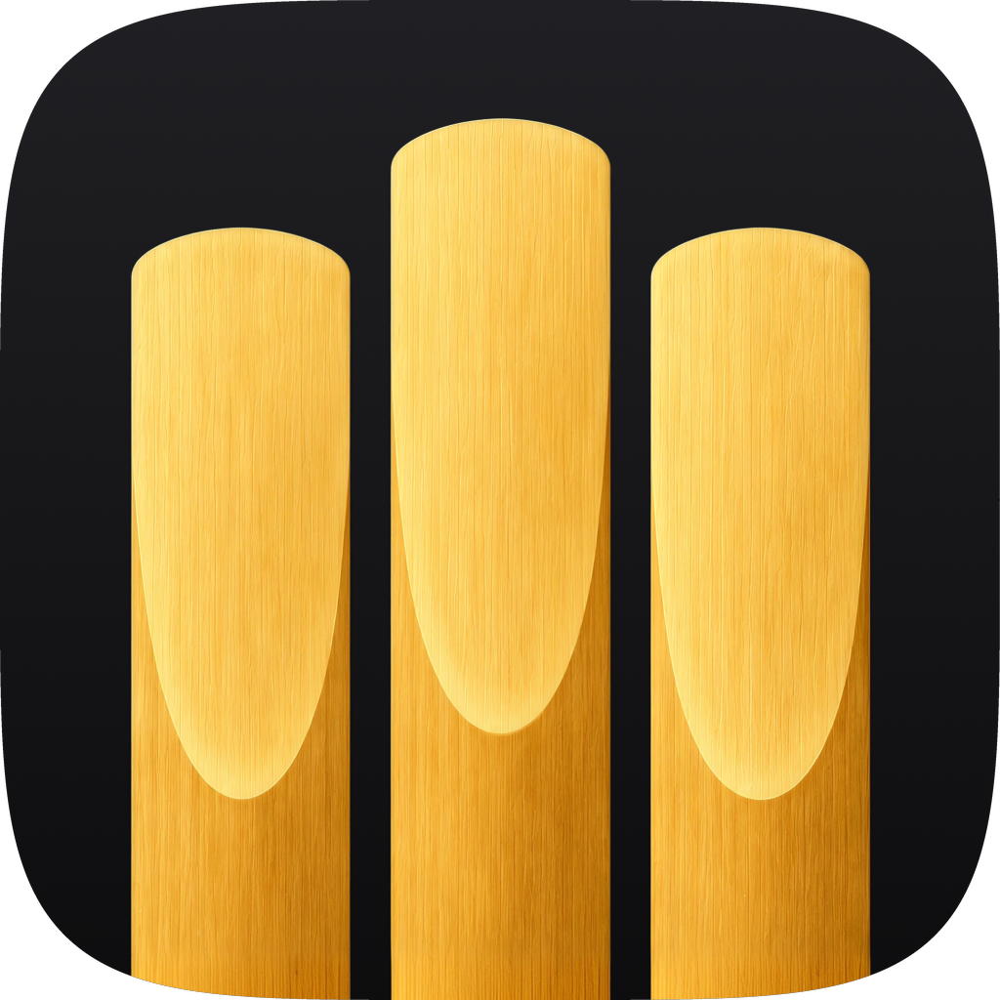
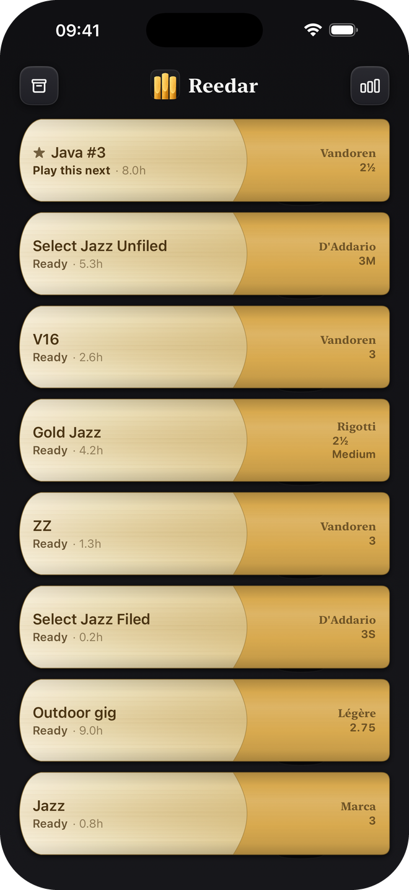
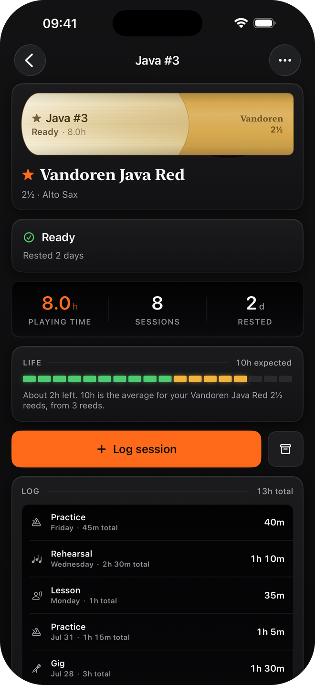
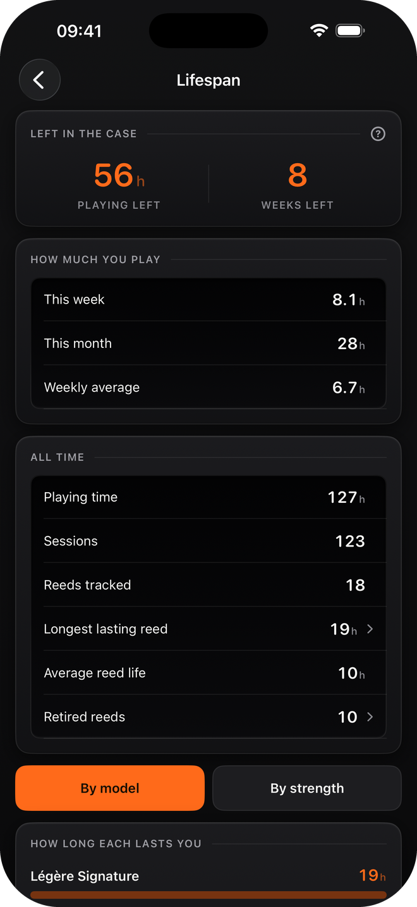
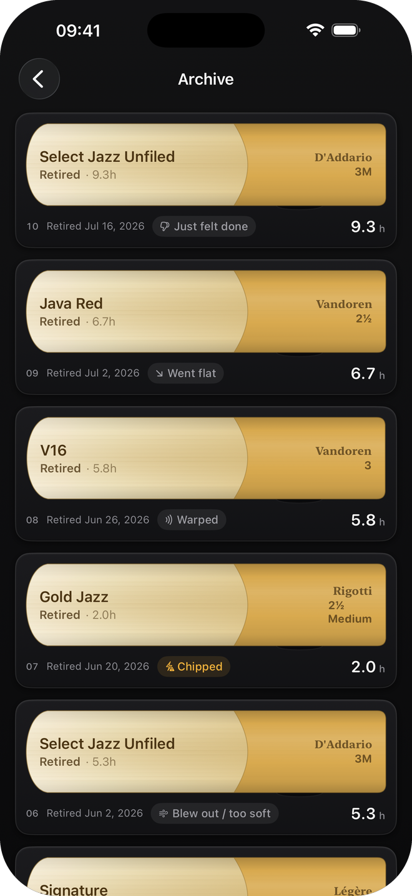

<div align="center">
  
  <h1>Reedar</h1>
  <p>
    A reed tracker for saxophone players.<br />
    Log what you play, retire reeds when they're done,<br />
    and see how long your reeds actually last.
  </p>
  <p>
    <a href="https://apps.apple.com/us/app/reedar-saxophone-reed-tracker/id6799631094">
      
    </a>
  </p>
  <p>
    
    
    
    
  </p>
  <p><sub>More screenshots and detail at <a href="https://reedar.app">reedar.app</a></sub></p>
</div>

## Build

Open `Reedar.xcodeproj` and run. iOS 18, SwiftUI and SwiftData, no third-party
dependencies.

## Layout

```
Reedar/
  App/        Entry point, root view, launch veil
  Models/     Reed, PlaySession, SessionContext, Instrument
  Catalog/    Reed brands, models and strength scales
  Features/   One folder per screen
  Design/     Palette, surfaces, buttons, hardware, the reed drawing
  Support/    Lifespan stats, rotation, formatting, sample data
docs/         The reedar.app site, served by GitHub Pages
Store/        App Store screenshots
Tools/        screenshots.sh, which renders the whole screenshot set
```

## Data model

Two persisted types. `Reed` is one physical reed; its catalog identity (brand,
model, strength) is denormalised onto the reed as text next to the catalog IDs,
so a reed retired today still reads correctly after the catalog changes, and a
custom reed has exactly the same shape as a catalog one. `PlaySession` is one
time that reed was played: `totalMinutes` is clock time, `playingMinutes` is
the part that actually wore the reed.

Each `SessionContext` (practice, lesson, rehearsal, gig, recording, audition)
carries a default ratio between the two, since a rehearsal is mostly counting
bars. It's only a starting point; the slider in the log flow wins.

Brands number strengths differently, so `StrengthScale` is stored per reed:
half steps, D'Addario Select Jazz, quarter steps, Rigotti's Light/Medium/Strong,
and Soft to Hard. The picker follows the scale of the selected model.

`Support/LifespanStats.swift` is the whole analysis layer. It groups retired
reeds by model, and by model plus strength, and ignores reeds that chipped or
were lost, since those say nothing about how long a model lasts.

## Design

Home is the case and nothing else: eight slots with a reed lying in each. Tap a
reed to open it, tap an empty slot to fill it, one button leads to the lifespan
data. Everything else happens to a reed you've already picked up, so the log
sheet never asks which one.

The reeds are drawn, not illustrated. `Design/ReedView.swift` builds the
silhouette from normalised coordinates, with grain, a vamp planed toward a
translucent tip, and darkening as hours build up. `CaseView.bed(in:)` picks the
bay arrangement that gets the most reed onto the glass, one column of eight or
two of four, by measuring rather than by asking what device it is.

Everything lives in `Design/`: `Palette` (adaptive light and dark), `Surfaces`,
`Buttons`, `Hardware`, `Theme` for metrics and type, and `Haptics`.
`docs/assets/styles.css` takes its colours from `Palette.swift` so the site and
the app match.

## Launch arguments

For opening a screen directly in the simulator: `-seedSampleData` (in-memory
store with a believable rotation), `-openReed`, `-openStats`, `-openAdd`,
`-openArchive`, `-openAbout`, `-openSettings`, `-resetIntro`, `-skipIntro`,
`-appearance light|dark|system`, `-accent <name>`.

## iCloud

The store is CloudKit-shaped already: no unique constraints, defaults on every
attribute, optional relationships with inverses, and `cloudKitDatabase:
.automatic`. To turn sync on, add the iCloud capability with CloudKit and a
container to the Reedar target, plus Background Modes with remote
notifications. No code change.

## Licence

Copyright © 2026 Zigao Wang. All rights reserved.
